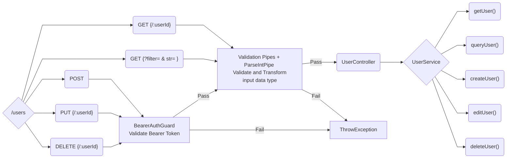
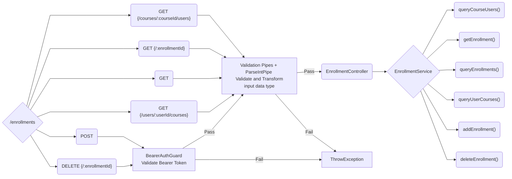
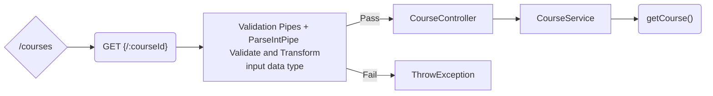
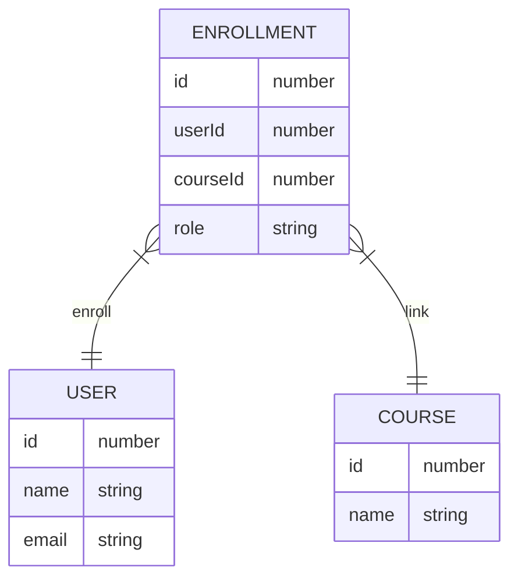

# NTUCool-Interview

## Preparation and Installation
### Nest.js
- install nest.js
    -  `npm install -g @nestjs/cli`
- install the required modules through 
    - `npm install`
- run the Web API with 
    - `npm run start`
- test the Web API through API tester like Postman(https://www.postman.com/), Insomnia(https://insomnia.rest/) 
### Local mysql database
- install mysql
    - `apt install mysql-server`
- create database `ntucool` in mysql
    - `CREATE DATABASE ntucool;`
- create user `admin` in mysql
    ```
        CREATE USER admin@localhost IDENTIFIED BY admin;
        GRANT ALL PRIVILEGES ON ntucool.* TO admin@localhost WITH GRANT OPTION
        FLUSH PRIVILEGES;
    ```
   

## Directories & Files
### Config
- TypeORM config for local mysql database connection 
- 
### Database
- initData for Users, Courses and Enrollments

### Dto
- Formats for how the data sent over the network

### Entities
- TypeORM entity for local mysql database

### Guards
- Guards for Bearer Token validation and Role authorization

### Modules
- User module, Enrollment module and Course module

### Roles
- Custom decorator (to assign roles to metadata) and role enum

## Restful API
### User API


- create User: **POST**`.../users`
- get User: **GET**`.../users/:userId`
- query User: **GET**`.../users?filter= & str=`
- edit User: **PUT**`.../users/:userId`
- delete User: **DELETE**`.../users/:userId`

### Enrollment API

- query Course Users: **GET** `.../enrollments/courses/:courseId/users`
- add Ennrollment: **POST**`.../enrollments`
- delete Enrollment: **DELETE**`.../enrollments/:enrollmentId`
- get Enrollment: **GET**`.../enrollments/:enrollmentId`
- query Enrollments: **GET**`..../enrollments?userId= &courseId= &role= `
- query User Courses: **GET**`.../enrollments/users/:userId/courses`

### Course API

- get Courses: **GET**`.../courses/:courseId`

### Swagger 
- `localhost:3000/api`
- 

## Some Implementations and Fix
### email must match regex \/^\S@\S$\/
- using ValidationPipe to verify the format of email
- `@Matches('\^[\\S]+@[\\S]+$') `
    
### return BadRequest 
- `throw new BadRequestException({ErrMsg});`

### return Unauthorized
-  `throw new UnauthorizedException();`

### Bearer Auth token Header, token = 'cool'
- use BearerAuthGuard to validate Bearer Token
- carry Bearer Token in the header of html request 
    - In Header: {Athorization: Bearer 'cool'}
    - extract auth token by 
        - `bearerToken = req.headers['authorization'].split(' ');`
        - should get 
            - `bearerToken.length === 2`
            - `bearerToken[0] === 'Bearer' && bearerToken[1] === 'cool'`
---
### Restful API issue
- remove unecessary verbs in url path 
- new API stated above 

### userId issue (using arr.index as userId)
- fixed after implement typeORM using local mysql database
- using mysql autoincrement id (start at 1)
<!-- - previously using users[] array index as userId
    - loss the unique property of userId
- solution
    - declare a `private id = 5` variable, update after each user creation
        - allow to maintain unique userId and used as increment id
        ```
                this.users.push({
                  id: this.id++,
                  name: username,
                  email: email,
                });
        ``` -->

### courseId issue (start from index 1)
- fixed after implement typeORM using local mysql database
- using mysql autoincrement id (start at 1)
- total of 5 entries according to dataset provided 
<!-- - previously start at 1, now start at 0 
- total of 5 entries according to dataset provided -->

### isValidId issue (using arr.index, inconsistent due to different index range)
- using TypeORM.find() to check database entries
```
    const exist = await this.coursesRepository.findOneBy({
      id: Number(courseId),
    });
    return exist === null ? false : true;
```
<!-- - previously differ in User, Enrollment and Course due to different id range
- utilise arr.some(), user's isValidId as example: 
    ```
        isValidId(userId: number): boolean {
            return this.users.some((obj) => obj.id === Number(userId));
          }
    ```  -->
    
### replace middleware to guards
#### implement `BearerAuthGuard`
- fix `bearerToken[1]` might cause internal server error problem
    - check before access 
    ```
         if (bearerToken.length !== 2)
            throw new BadRequestException('Invalid Bearer Token!');
    ```
- assign BearerAuthGuard with decorator `useGuards(BearerAuthGuard)`

#### implement custom decorator `@Roles()`
- Role enum contain two roles, User and Admin
- custom decorator to attach required roles to the metadata
- assign role with `@Roles(Role.Admin)`

#### implement `RolesGuard`
- in **BearerAuthGuard**, after pass Bearer Token validation, attach admin role info to HttpRequest
    ```
        if (bearerToken[0] === 'Bearer' && bearerToken[1] === 'cool') {
            // attach user's role to HttpRequest
            request.user = { roles: Role.User };
            return true;
        } 
    ```
- extract `requiredRoles` from metadata then verify with `user.roles` attached in HttpRequest
    ```
        return requiredRoles.some((role) => user.roles?.includes(role));
    ```
- assign RolesGuard with decorator `useGuards(RolesGuard)`

### coding style issue 
- rename files name
- readjust files structure
- rename variables, functions, classes name using camelCase and PascalCase
- implement prettier and eslint to help adjusting code structure
-  references: 
    -  https://angular.io/guide/styleguide 
    -  https://google.github.io/styleguide/tsguide.html

### implement TypeORM with local mysql database
- connect to local mysql database with `typeorm.config.ts`
- create 3 entities for users, enrollments and courses
- implement TypeORM  One-to-Many and Many-to-One relation towards UserEntity--EnrollmentEntity and CourseEntity--EnrollmentEntity
- implement TypeORM functions (find(), findOneBy(), createQueryBuilder() etc) in service providers functions
